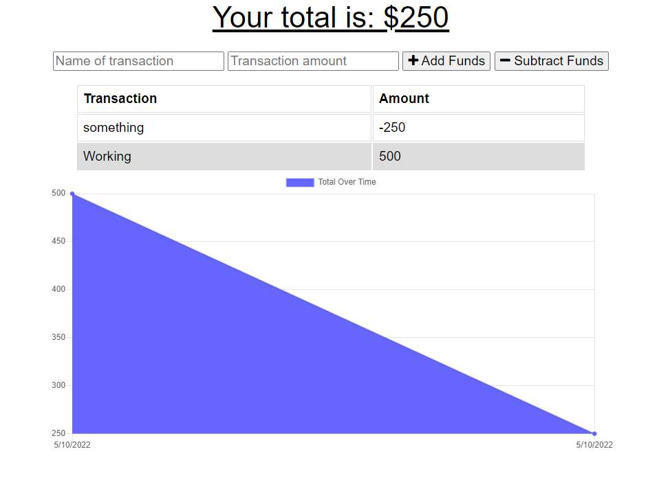

# My-Budget-Hero, a budget tracker app

## Description:

Using IndexedDB create a progressive web application that saves data when offline.
Use web manifest to create icons when downloading the app.

## Testing Instructions:

Once the application is up and running, a user can add data. If a user is offline and data is entered then the data is pushed to the live application once the internet has been restored.

## Screenshot of App in use:

## Built With:

- Javascript
- express
- mongoose
- indexeddb

## Contribution:

Made with ❤️ by Avrumie Safranovitz
